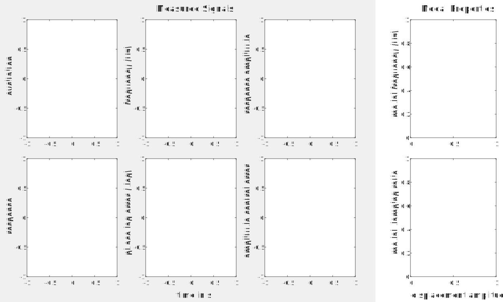
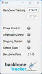

# Backbone Tracking

The *Backbone Tracker* is a tool for phase-locked-loop-based experimental continuation of phase-resonant backbone curves.

This is part of NLtest. For copyright and licensing, see `'README.md'` in the main folder of NLtest.

If this is the first time you see this document, please go directly to [Getting started](#getting-started).

## Table of content

- [Getting started](#getting-started)
- [Running the provided examples](#running-the-provided-examples)
- [Prepare and do your own backbone test](#prepare-and-do-your-own-backbone-test)
- [Requirements](#requirements)
- [What to do if the controller does not work?](#what-to-do-if-the-controller-does-not-work)
- [Test procedure](#test-procedure)
- [List of files](#list-of-files)
- [Hardware interface](#hardware-interface)
- [State-space model of the advanced virtual experiment](#state-space-model-of-the-advanced-virtual-experiment)
- [References](#references)

## Getting started

Get an overview of the main features of the *Backbone Tracker*, we recommend [running the provided examples](#running-the-provided-examples).

Then, you are ready to [prepare and do your own backbone test](#prepare-and-do-your-own-backbone-test).

Should you encounter problems, please check the [requirements](#requirements), and see the section [What to do if the controller does not work?](#what-to-do-if-the-controller-does-not-work).

If you are interested in details of the implementation and/or you want to modify the tool, you are referred to the section [test procedure](#test-procedure), the [list of files](#list-of-files), and the section [hardware interface](#hardware-interface).

For the technical background, and a mathematical description of the theory underlying the *Backbone Tracker*, see [Hippold.2024].

## Running the provided examples

In this section, we describe the purpose of each provided example and instructions how to run them.
The typical run time for each script is less than 1 minute on a common office laptop. The total duration may be longer, if Simulink is opened for the first time during a session.

### Virtual backbone tracking experiment

In `'EXAMPLES/BT01_virtualRubBeR'`, a virtual experiment is considered involving a mathematical model of a cantilevered beam with an elastic dry friction element, inspired by the RubBeR test rig [Scheel.2020].

There is a *simple* and an *advanced* version.

For the *simple* example, run the script `VirtualRubBeR.m`. The purpose of the simple example is to get a quick, high-level overview of the capabilities of the *Backbone Tracker*. The main simplifying aspects are:
- Idealized exciter
- Loading of a stored plant model to simplify the code
- Single response sensor (drive point)
- Use of default settings
- No post-processing; only visualization of the modal properties estimated online

For the *advanced* example, run the script `VirtualRubBeRAdvanced.m`. The advanced example shall provide a deeper understanding of the *Backbone Tracker* and the identification of modal properties from the backbone curve. The example features:
- A common electro-mechanical shaker model
- An adjustable plant model which is set up using functions from NLvib [GitHub.NLvib]
- Multiple response sensors
- Use of custom settings
- Validation of modal properties identified from virtual backbone test against numerical reference

If you are interested in details of the model, see the section [State-space model of the advanced virtual experiment](#state-space-model-of-the-advanced-virtual-experiment).

### Post-processing data provided from a real backbone test

The script `'EXAMPLES/BT02_realExperiment/PostprocessingRealExperiment.m'` is analogous to the post-processing part of the advanced virtual experiment described above.
The important difference is that it relies on real data obtained from a physical experiment.
Also, it contains more post-processing: 
- Evaluate modal-harmonic decomposition of mechanical energy
- Reconstruct frequency response curve using Single Nonlinear Mode Theory

### Tuning the adaptive filter based on provided real measurement data

Adaptive filters are core components of modern implementations of control-based nonlinear vibration testing.
In general, they are useful for steady-flow estimation of the Fourier decomposition of response and/or excitation.
In the *Backbone Tracker*, adaptive filters are used, in particular, to estimate the phase lag between the fundamental harmonics of response and excitation.
The difference of the estimated phase lag to the set value (resonant phase lag) is fed to the phase controller.
For successful control, the estimation must be sufficiently accurate and fast, i.e., neither distorted nor delayed.
Noise is the most important limitation here:
Faster adaptive filters tend to amplify noise, resulting in more severe distortion.
Thus, a good compromise between control quality under noise and speed must be found.
The script in `'EXAMPLES/PRE01_adaptiveFilterTuning'` illustrates how to find such a compromise, based on provided real measurement data, using the method proposed in [Hippold.2024].

## Prepare and do your own Backbone Test

In this section, we would like to guide you to your first successful tracking of a backbone of your own test rig.
Before you start, it is crucial to specify clearly your test objectives.
Here are some key questions that you should be able to answer:
- Which is the target mode (whose phase-resonant backbone is to be tracked)?
- For what range of vibration levels would you like to obtain the backbone?
- Do you wish to obtain a meaningful amplitude-dependent modal damping ratio?
- Do you need a mass-normalized modal deflection shape?
- Do you suspect isolated frequency response branches?

### Set up a model of your structure under test and select instrumentation

The steps in this section are optional but highly recommended.
Depending on the complexity of your test rig and the nonlinear behavior of your structure under test, the ambitious character of the test objectives, and the required quality of the results, you may want to spend more or less effort on these steps.

If the purpose of the test is model validation, it is safe to assume that you have some kind of (preliminary) model.
Otherwise, if you have a CAD file and know the material(s), it is relatively easy to set up at least a linear finite element model of the structure under test.
Any conventional FE tool can be used for this task.
The tool `NLvib` can be used to import this FE model, derive a reduced order model using some of the most common types of component mode synthesis methods, specify a concentrated load to account for the force transmitted by a shaker via a stinger, and include nonlinear elements.
Subsequently, you can compute linear and nonlinear frequency response curves for harmonic excitation near the frequency of your target mode, and/or carry out a numerical nonlinear modal analysis of your target mode.
At this stage, you can idealize the exciter by imposing a perfectly harmonic forcing, which allows you to use highly efficient simulation methods, such as Harmonic Balance, to compute the periodic steady-state response.
`NLvib` combines Harmonic Balance with numerical path continuation, so that you can easily compute unstable parts of the frequency-response curves (without having to worry about control).
From the periodic response, you can recover the displacement/velocity/acceleration at each FE node in each coordinate direction of interest.
Together with the information of what range of vibration levels you are interested, this allows you to determine the required range of forces to be provided by your exciter.
This enables you to select a suitable drive point and exciter, given the hardware available to you.
If you wish to obtain a meaningful damping ratio and/or need a mass-normalized modal deflection shape, it is crucial to acquire the response at the drive point.
The simulation results tell you the range of the response level, which is crucial for selecting an appropriate sensor type (displacement, velocity, acceleration) and model.
Moreover, the simulation results tell you whether or not to expect isolated frequency-response curves and/or resonant modal interactions.
Those results further enable you to determine whether the operational and/or modal deflection shape varies considerably in the vibration level range of interest.
If so, you will need more than a single sensor.
Some further analysis then enables you make an informed decision on the number and placement of the additional sensors.
For the purpose of making such decisions, the linear model and the nonlinear elements do not have to be a perfect representation of the physical structure under test.
(If you knew that your model is perfect, you probably would not have to do any tests.)
Because of the uncertainties associated with your model, at this point, it makes sense to vary parameters, including those associated with the nonlinear elements and the linear modal damping, in reasonable bounds.

For the above tasks, the `NLvib`-based part of the analysis in `'EXAMPLES/BT01_virtualRubBeR/VirtualRubBeRAdvanced.m'` can be used as point of departure.

### Identify linear structure under test and plant

It is recommended to do a shaker-based linear modal analysis before the backbone test.
This satisfies multiple purposes.
First, it helps you to validate your linear model of the structure under test.
Large discrepancies in linear frequencies, missing or spurious modes might indicate that there is something wrong with your test rig.
If your linear model is quite inaccurate, you cannot hope to validate your nonlinear one.
Further, the modal parameters of the target mode are needed for the theory-driven control design in accordance with [Hippold.2024].
These are also needed when initializing the backbone test (initial excitation frequency; initial voltage in case of amplitude control).
Knowledge of other linear modal frequencies can be useful to check for internal resonance conditions.
If the modal deflection shape varies, you might want to quantify the relevant modal contributions, and those are needed to mass-normalize the nonlinear modal deflection shape, and, hence, to obtain an accurate modal damping ratio in the post-processing, see `'EXAMPLES/BT02_realExperiment/PostprocessingRealExperiment.m'`.
How many linear modes you need to identify, is something you can estimate with your linear model (see previous section).

We recommend to use a shaker-based linear modal test with (pseudo-)random excitation at a low level.
The above considerations should provide guidance whether it is sufficient to identify just the target mode, or if you need to identify more.
From the known input voltage to the power amplifier of the shaker (simply called *shaker input voltage* in the following) and the recorded force and response time series, two Frequency Response Functions (FRFs) can be estimated:
(1) force to response and (2) voltage to response.
Subsequently, the modal properties of the SUT from (1) and of the plant from (2) can be identified using standard methods of linear modal analysis.
Assuming the frequency of the target mode is well-separated, a single degree-of-freedom (SDOF) fit should be sufficient.
Besides modal frequency, damping ratio and mass-normalized entries of the deflection shape at the sensor locations are needed.
Signal generation, FRF and linear modal parameter estimation are not implemented in this tool, but a variety of conventional commercial or open tools are available for such standard tasks.
`EXAMPLES\BT02_realExperiment\DATAlinearSUTModes.mat` and `EXAMPLES\BT02_realExperiment\DATA\linearPlantModes.mat` contain linear modal data from a real test rig.
`EXAMPLES\BT02_realExperiment\InitializeRealExperiment.m` and `EXAMPLES\BT02_realExperiment\PostprocessingRealExperiment.m` illustrate how this data is used for control design / backbone test initialization and post-processing, respectively.

### Tune the adaptive filter

The parameters of the adaptive filter are the harmonic order $H$ and the cutoff frequency $\omega_{\mathrm{LP}}$.

$H$ should be high enough to capture all non-negligible higher harmonics in the response and excitation signals throughout the backbone test.
The higher $H$, the higher the computational burden for the real time controller, which may, in turn, limit the maximum achievable sampling rate.
Further, the sampling rate of the acquisition and control system may limit the highest frequency (and thus $H$) that can be resolved without aliasing.
If in doubt, it is proposed to set $H$ as high as possible under the two constraints of real time capability and aliasing avoidance.

The higher $\omega_{\mathrm{LP}}$, the faster the filter, but the stronger the noise-induced phase fluctuations.
In other words, faster adaptive filters (higher $\omega_{\mathrm{LP}}$) can be used when the signal-to-noise ratio is better.
It is a reasonable assumption that noise grows sub-proportionally with the signal, so that the signal-to-noise ratio increases with the vibration level.
Consequently, the lowest vibration level of interest dictates the maximum affordable cutoff frequency (if a constant $\omega_{\mathrm{LP}}$ is to be used, which is the case in the current release of the *Backbone Tracker*).
This is why it is proposed to tune the adaptive filter to measurement data acquired from an open-loop test under excitation conditions at/near the lowest-level backbone point.

To do the open-loop test and record the data, you can use the *Backbone Tracker*.
To do so, set all parameters in `EXAMPLES/BT02_realExperiment/initializeRealExperiment.m` as required for your backbone test except.
An arbitrary value can be used for $\omega_{\mathrm{LP}}$ here as it is not relevant.
Deactivate phase control by inserting the following code after the function call to `controllerDesignBackboneTracker`:
        `settings.gainsPhaseController.kp = 0;`
        `settings.gainsPhaseController.ki = 0;`
This way, you overwrite the control gains with zero.
Start the experiment and interrupt it after ca. 200-1000 periods by clicking "STOP" in the GUI.
The number of periods must be large enough to ensure that the transient of the plant has decayed, and there are enough periods assessing the extent of the phase distortion produced by the adaptive filter.
The plant decay can be estimated analogous to Eq. (44) in [Hippold.2024] using the linear plant decay rate $\delta_{\mathrm{p}}$ (cf. Eq. A.5 in [Hippold.2024]; computed within `controllerDesignBackboneTracker.m`).

Adaptive filters with different $\omega_{\mathrm{LP}}$ are then applied to the acquired data, and the highest $\omega_{\mathrm{LP}}$ is selected that still leads to phase fluctuations below a specified threshold.
Such a tuning procedure is illustrated in the example in `'EXAMPLES/PRE01_adaptiveFilterTuning'`, see [Tuning the adaptive filter based on provided real measurement data](#tuning-the-adaptive-filter-based-on-provided-real-measurement-data).
You can apply this script to your open-loop test data by adjusting the `fileNameRecording` (and possibly the `BASEFOLDER`).

### Adjust the files provided for the physical experiment to your test rig and objectives

We recommend to make a copy of the folder `'EXAMPLES/BT02_realExperiment' which you use as point of departure for your own test files.
In general, **header and comments in the scripts within that folder should guide you to make the appropriate adjustments**.

First, set all required parameters to initialize the backbone test in the script `InitializeRealExperiment.m`.
The script uses the linear modal data obtained as described in [Identify linear structure under test and plant](#identify-linear-structure-under-test-and-plant), and you should specify the parameters of the adaptive filter tuned as described in [Tune the adaptive filter](#tune-the-adaptive-filter).
Among others, the number of sensors and the respective response quantity is to be specified.
Compared to a virtual experiment, the sensitivities of the transducers must be provided.
With some sensors, signal processing may cause a considerable but known delay.
This may be crucial for phase control and should thus be specified.
The delay is compensated by shifting the less-delayed signal during the backbone test.
Note: The signals are still recorded as raw signals; i.e., the delay must still be accounted for during post-processing (e.g. by appropriate phase shifting of the Fourier coefficients).
Among others, the excitation level profile is to be specified in this script.
Voltage stepping should be the first choice, as the control problem is simpler in that case.
If you expect isolated frequency-response curves, on the other hand, response amplitude stepping should be used (otherwise you cannot hope to uncover the complete backbone curve.)
Furthermore, open the build Simulink model `realExperiment.slx`.
You need to ensure that the number of I/0 blocks matches your set-up and that the correct I/O channel is selected in each of those blocks.
The name of the subsystem and the subsystem's output for each response sensor, which is *not* the drive point, should be of form `response_<X>` where X is the index of that sensor (matching the order in the array of sensitivities). If this naming convention is followed, all response signals are added automatically to the list of recorded variables in the script `RunRealExperiment.m`. If the naming convention is not followed, the list of recorded variables must be modified manually.
The files in `'EXAMPLES/BT02_realExperiment'` have been designed for the dSPACE MicroLabBox (version 1, ds1202).
For other dSPACE hardware, specify the system target file matching your platform in the `Code generation` panel in the `Configuration Parameters` menu.
Also, select correct blocks of the Real-Time Interface library to access the I/O channels of the hardware module.
Finally, specify the platform name in the file `MAPortConfig_backbone.xml`.
(Should you rename the Simulink model, you need to update the name also in `MAPortConfig_backbone.xml` where the associated sdf file is specified.)
After making the adjustments, run the script.
This will build the Simulink model (`realExperiment.slx`) and store the relevant settings in a .mat file.

Second, edit the script `RunRealExperiment.m`.
This is the interface which sets up the communication with the hardware platform.
Here, you have to specify the settings file and the dSPACE release.
Run the script to load the compiled Simulink model to your hardware.
Then, two Matlab windows open, one for visualizing the signals during runtime and a GUI to start and stop the measurements.
After clicking the `START` button, the experiment is run and data is collected.
After successful completion, the recorded data is saved to a .mat file with name `measurement_\<timestamp>` in the subfolder `DATA`.
If needed, you can manually stop the experiment with the `STOP` button.
In that event, the voltage output **drops instantly to zero**; the recorded data is still saved as in the event of a regular completion.
If you want to abort the test before you clicked `START`, just close the UI window.
**Do not interrupt the test by stopping the script from the Matlab editor** (the program will continue running on the hardware, and you will have to switch off/on the hardware before a new test).
Once the test has finished, clicking `START` has no effect.
To repeat the test, re-run the script.

 
 

                                        	                
Finally, edit the script `PostprocessingRealExperiment.m`.
Here, you can load the saved data and carry out whatever analysis you are interested in.
Note that the damping ratio displaced at runtime is a poor-man's-estimate, which presumes an amplitude-invariant modal deflection shape.
A more precise estimate requires multiple sensors.
The difference is illustrated in `'EXAMPLES/BT01_virtualRubBeR/VirtualRubBeRAdvanced.m'`.
The precise estimation is also done in `PostprocessingRealExperiment.m`.

Should you encounter problems with the controller, see the section [What to do if the controller does not work?](#what-to-do-if-the-controller-does-not-work).

## Requirements

This tool is based on **Matlab/Simulink**.
These toolboxes are also required:
- Optimization Toolbox
- DSP System Toolbox (which also requires the Signal Processing Toolbox)
- Simulink Coder (for real tests)

The Simulink models have been saved with Matlab version 2024b. Therefore, the models cannot be opened with a previous version. However, the files can be saved as previous versions if needed, using Matlab version 2024b or higher.

For the advanced virtual experiments, the tool `NLvib` is required. The recent `NLvib` version can be downloaded from https://github.com/maltekrack/NLvib/. Extract it in a (arbitrary sub-)folder within the NLtest `SRC` folder.

The tool is designed for usage with **dSPACE** hardware. In particular, the files provided in `'EXAMPLES/BT02_realExperiment'` have been designed for the dSPACE MicroLabBox (version 1, ds1202). For any other hardware, smaller or larger adjustments may be needed, see section [Adjust the files provided for the physical experiment to your test rig and objectives](#adjust-the-files-provided-for-the-physical-experiment-to-your-test-rig-and-objectives).
The following software is required to run the experiment:
- dSPACE Real-Time Interface (RTI)
- dSPACE Platform API Package
- a C/C++ compiler (Make sure this is installed for your hardware by decrypting "dSPACE RCP and HIL".)

Your hardware platform must be registered by using dSPACE's "Platform manager" (included e.g. in "ControlDesk" or "Firmware Manager").

Note that the software dSPACE "ControlDesk" is *not* needed to run the *Backbone Tracker*.

The Matlab interface for communication with the aforementioned MicroLabBox has been successfully tested with Matlab version 2022a. It is known that modifications are needed for Matlab version 2016b and lower.

## What to do if the controller does not work?

A working controller settles reasonably fast to a state of low phase lag errors (and amplitude errors, if amplitude control is used), and maintains this for the requested duration. A not-working controller may *diverge*, or it may be *too slow* to be practically useful, and/or it may reach a state of *high errors*. In this section, common reasons for those failure modes are presented, along with means to counter them.

### Violation of assumptions underlying theory-driven control design
The *Backbone Tracker* uses the theory-driven method proposed in [Hippold.2024] for selecting the gains of the proportional-integral controllers. If the simplifying assumptions underlying that theory are violated, the controller cannot be expected to work well. In the following, those assumptions stated, along with instructions how to check their validity, and what to do should they be violated.
- **Phase-neutral exciter**: A first way to check this assumption is to inspect the frequency response function from exciter input voltage to applied force, which is obtained in the course of [identifying the linear SUT and plant](#identify-linear-structure-under-test-and-plant). The phase shift should be close to zero throughout the frequency range of the test. However, in our experience good control performance can be achieved for phase shifts up to 20°. A second way to check phase-neutrality is during backbone tracking or in the post-processing by directly monitoring the phase lag of the applied force compared to the voltage, i.e., the angle of the fundamental Fourier coefficient of the applied force as computed by the adaptive filter. To come closer to phase-neutral excitation, in the case of force excitation, one can try to adjust the exciter configuration in such a way that a lower exciter-structure mass ratio is achieved. More specifically, the exciter's moving mass should be as low as possible, and it should be attached to a point with relatively small displacement (if other practical constraints permit this). As alternative, a manual adjustment of the controller gains might improve the control performance, see [Strategy for manual re-tuning](#strategy-for-manual-re-tuning).
- **Single Nonlinear Mode Theory**: The target modal frequency must be well-separated and away from any internal resonance condition. Hence, a first check of this non-resonance condition can be done by inspecting the linear modal frequencies. If the non-resonance condition does not hold, strong modal interactions may occur. Thus, another check involves the inspection of the contributions $E(m,h)$ to the mechanical energy of mode $m$ and harmonic $h$. If there is a $1:3$ internal resonance between a target mode 1 and mode 2, one would expect a steep increase of $E(2,3)$ for sufficiently high vibration levels. The script `'EXAMPLES/BT02_realExperiment/PostprocessingRealExperiment.m'` estimates these contributions and identify the most important ones from data acquired during backbone tracking. Only if the non-resonance condition holds, the structure behaves like a single nonlinear modal oscillator, so that one can achieve phase resonance with a single exciter, and restricting the control to the fundamental harmonic. Thus, beyond the onset of a resonant modal interaction, no meaningful amplitude-dependent modal parameters can be obtained from the phase-resonant backbone, and the phase-resonant backbone will be highly sensitive to the drive point. If the purpose of the test is to specifically analyze modal interactions, one should consider doing frequency-response tests instead of (or in addition to) a backbone test. See also [Woiwode.2024].
- **Design for linear regime**: In [Hippold.2024], it was proposed to design the control parameters for the low-level regime of the structure under test, and to use these constant parameters throughout the backbone. Consequently, sub-optimal performance is expected at higher vibration levels in the nonlinear regime. If a resonant modal interaction has been ruled out, manual re-tuning may counter poor control performance, see [Strategy for manual re-tuning](#strategy-for-manual-re-tuning). The extension of the control design method to the nonlinear regime is currently under research.
- **Asymptotic behavior around locked state**: The proposed control design method relies on a linearization of the equations governing the closed loop behavior around the locked state (zero-mean control errors). If the initial condition is far from the locked state, sub-optimal performance is expected. In practice, this may happen if the initial excitation level is too high leading to strongly nonlinear behavior, so that the initial frequency (linear modal frequency on default) is far from the modal frequency at that level. In that case, a lower initial excitation level should be considered. Poor initial conditions may also arise when taking too large steps along the backbone, in which case the step size within the excitation level profile should be reduced.

### Other common problems
Besides the violation of assumptions underlying the control design, other causes have been observed that diminish the control performance. The following list is based on our experience so far and is certainly not exhaustive.
- Poor choice of cutoff frequency: A too low cutoff frequency of the adaptive filters causes unacceptably long test durations (e.g., risking damage at high vibration levels, causing severe time-variability due to thermal effects). A too high cutoff frequency, on the other hand, may lead to high (noise-induced) fluctuations in the estimated phase lag (and response amplitude, if amplitude control is used). Note that the signal-to-noise ratio depends on the vibration level, so that the noise-induced fluctuations may be acceptable in some range, but exceed the tolerance(s) of the automatic settling detection in other ranges. If the controller still settles in the mean with reasonable speed, an option may be to select a higher tolerance and simply accept larger fluctuations of the control error. If no reasonable compromise between control quality under noise and speed can be found, one should attempt to improve the signal-to-noise ratio. This can be achieved, in particular, by modifying the instrumentation (to reduce noise), and/or to start the backbone tracking at a higher initial vibration level (to increase the signal strength). See also [Tune the adaptive filter](#tune-the-adaptive-filter).
- Long transients in voltage stepping mode: If the plant is very lightly damped, the response takes a long time to reach a steady state when the excitation is changed. This is accounted for by using a ramp between voltage levels with a length equal to the step response settling time of the response amplitude. While this highly increases the probability of reaching an amplitude-settled state for each backbone point, it might lead to unacceptably long testing times. You may reduce the ramp duration (by specifying a custom value to the setting `rampTime_s`), risking not to reach an amplitude-settled state any longer. A better solution may be to change from voltage stepping to response amplitude stepping. The purpose of the additional controller is to reduce the amplitude settling time.
- Increased phase fluctuations when amplitude control is activated: The [assumptions underlying the control design](#violation-of-assumptions-underlying-theory-driven-control-design) imply that the phase settles is independent of the amplitude, and hence there is no interaction between phase and amplitude controller. If those assumptions are violated, the phase control error might show some noise-like fluctuations when amplitude control is active. Our observations suggest that these can often be reduced by changing the controller design option from `optimal` to `conservative` at the cost of a longer phase settling duration.
- Wrong response quantity: If the response quantity (displacement, velocity or acceleration) is erroneously specified, phase control will fail since the target phase lag does not correspond to phase resonance. Moreover, amplitude control yields unexpected behavior due to an erroneous conversion from whatever is measured to displacement.
- Voltage limit reached: When using amplitude control, the user has to ensure that the chosen voltage limit is high enough. Otherwise, the tracking will get stuck before reaching the final level. To protect the hardware in case of a divergent amplitude controller, however, it is not recommended to set the voltage limit arbitrarily high. Keep in mind that the maximum excitation might also be limited by the hardware (e.g. current limit of the amplifier).
- Poor plant identification: The linear modal parameters of the plant enter the control design and test initialization. Although a relatively high robustness has been observed, the modal parameters should be reasonably accurate to achieve good performance.

### Strategy for manual re-tuning
If the [assumptions underlying the control design](#violation-of-assumptions-underlying-theory-driven-control-design) are violated, manual adjustment of the control gains might be useful. A few hints are provided based on theory and experience. As a first rule, always start with the stepped voltage case since this reduces the number of design variables. Further, it seems useful to distinguish *too slow* settling from a failure of settling due to *high control errors* or even *divergence*.

#### Controller too slow
If the settling requires an unacceptably long time, it is recommended to first attempt to increase the cutoff frequency of the adaptive filters, and to consider amplitude stepping, see [Other common problems](#other-common-problems), points 1 and 2. If that does not solve the problem, it is recommended to change the control gains. The easiest way to do so is to increase the parameter `lambda_I_phase` (and `lambda_I_amp` if you use amplitude stepping) within the function `SRC/controllerDesignBackboneTracker.m`. This is expected to speed up the phase settling at the cost of a larger frequency overshoot (see Figs. 3 and 6 in [Hippold.2024]). If that still does not solve the problem, it is likely that the [assumptions underlying the control design](#violation-of-assumptions-underlying-theory-driven-control-design) are violated. Using the theory-driven design as point of departure, one may then consider to change the proportional and integral gains individually (`settings.gainsPhaseController.kp`, `settings.gainsPhaseController.ki`, and analogous for `settings.gainsAmplitudeController`). If you change the cutoff frequency in the course of this manual re-tuning, it is recommended to account for the relation between dimensionless and dimensional integral gain and the cutoff frequency, see last lines of `SRC/controllerDesignBackboneTracker.m`.

#### Control errors too high or even diverging
In the case of high control errors, it is recommended to first attempt to reduce the cutoff frequency of the adaptive filters, and, if amplitude control is used, to consider changing the controller design option from `optimal` to `conservative`, see [Other common problems](#other-common-problems), points 1 and 3. If that does not solve the problem, it is recommended to change the control gains in the way described under [Controller too slow](#controller-too-slow).

The case of a divergence is the most complicated one, since the gains can be either too high or too low. In our experience, it is sometimes possible to separate the cases by observing the onset of instability. If it appears to arise out of growing fluctuations of the control error, the gains are likely too high. In this case, try the measures described above for the case of high control errors. If the instability starts with a sudden drop of the response, the gains are likely too low, so that the behavior is similar to an open loop, with a jump expected near resonance. In this case, consider the measures described under [Controller too slow](#controller-too-slow).

### Run a virtual experiment
If all above measures do not work, or if you want to modify the tool, it can be useful to run a virtual experiment.
The important benefit is that you can easily generate an ideal reference, e.g., using Harmonic Balance and path continuation, see [Set up a model of your structure under test](#set-up-a-model-of-your-structure-under-test-and-select-instrumentation).
The script `'EXAMPLES/BT01_virtualRubBeR/VirtualRubBeRAdvanced.m'` can be used as point of departure.

## Test procedure

An overview of the test procedure is provided in the figure below.


The key aspects are described in the following.

### Startup
The phase-locked loop is initialized with a constant frequency (by default equal to linear natural frequency). If the test type is `'steppedVoltage'`, the initial voltage amplitude is equal to the first voltage level. If the test type is `'steppedAmplitude'`, the initial voltage amplitude is estimated based on the provided linear plant properties. When the experiment is started, the voltage is ramped smoothly from zero to the first level. The duration of the ramp is based on the settling time of the linearized plant [Hippold.2024] and called `initialRampTime`. It is normal that large control errors are displayed in this phase since neither the transient nor the initial steady state coincide (exactly) with the desired backbone point. The phase and amplitude errors will decrease as soon as the respective controllers are activated. When the initial voltage is reached, the phase controller is activated and thus the excitation frequency is now free to change. It is waited until the phase error has settled (detailed description of the settling detection see below). In case of `'steppedVoltage'`, the main routine is then started. In case of `'steppedAmplitude'` the response amplitude controller is now activated, followed by settling detection for phase and amplitude and subsequent starting of the main routine.

### Settling detection
The purpose of the settling detection is to check if specified tolerances of the control errors are met. The general idea is the same as for the "lock-in detection" described in Section 4.3 of [Hippold.2024] but with some modifications described here. Without amplitude control (`'steppedVoltage'`), the phase lag error is the only monitored error quantity. With amplitude control (`'steppedAmplitude'`), the amplitude error (relative to the set point) is also required to meet the specified tolerance. The settling criterion requires the error(s) to be within tolerance for a specified number of oscillation periods. As soon as the tolerance corridor is left, the period counter is reset to zero. Once the required period count is reached, the system is regarded as *settled* and the *recording phase* starts. During the recording phase, the data required for the analysis of the backbone points / estimation of the modal parameters is acquired. (The raw signals are recorded throughout the whole test but the recording phase is when the actually used data is obtained.) No warning is given if the control error should leave the tolerance corridor during the recording phase. Therefore, it is important to specify a sufficiently large number of periods that are required to remain within tolerance prior to the recording phase. Otherwise a short pass through the tolerance corridor with subsequent overshoot might falsely be detected as settling. Note that for `'steppedVoltage'`, amplitude settling is not required.

More sophisticated settling criteria can be implemented by the user.

### Main routine
The main routine starts with the first recording phase. If the final level is not reached yet, the voltage amplitude or the response amplitude set point is ramped to the next level after the recording phase. A smooth half-cosine shaped ramp is used. In case of `'steppedVoltage'`, the default duration of the ramp (`rampTime`)  is based on the settling time of the amplitude of the linearized plant (see Section 4.1 of [Hippold.2024]). In case of `'steppedAmplitude'`, the default ramp time is 100 linear periods to guarantee a smooth transition, but generally independent of the plant properties. After the ramp, the so-called *hold phase* begins. In that phase, settling detection and subsequent recording take place. This process is repeated until the final level is reached. Then, the shutdown routine starts.

### Shutdown
After the last recording phase is over, a shutdown sequence is initiated to guarantee a smooth shutdown of the experiment. First, the amplitude controller is deactivated (in case it was active); the last voltage amplitude is maintained. Second, the PLL is deactivated; the last excitation frequency is maintained. Finally, the voltage amplitude is linearly ramped to zero over the number of periods specified as the `'initialRampTime'`. As during startup, large control errors might be displayed in that last phase since the controllers are deactivated.

## List of files

The `SRC` folder contains post-processing functions which are useful also beyond backbones, and it contains files specifically related to the *Backbone Tracker*.

Post-processing functions:
- `estimateFourierCoefficientsFromSteppedSine.m`: This function can be used for any stepped sine test (including but not limited to backbone tests), for estimating Fourier coefficients of acquired measurements.
- `estimateModalPropertiesFromBackbone.m`: This function estimates modal parameters from the data acquired during a backbone test.

Backbone Tracker files:
- `checkSettingsBackboneTracker.m`: This function checks settings specified by the user and sets default values where applicable.
- `controllerDesignBackboneTracker.m`: This function implements the method proposed in [Hippold.2024] for selecting the proportional and integral control gains, for given adaptive filter cutoff frequency, exciter moving mass, as well as linear modal parameters of plant and structure under test.
- `BackboneTracker.slx`: This Simulink model, along with further referenced blocks `Averaging.slx`, `Fourier_Decomposition_AF.slx`, and `halfCosineRamp.slx`, forms the core of the *Backbone Tracker*.

For a description of the files in the folder `EXAMPLES`, see [Running the provided examples](#running-the-provided-examples) and [Adjust the files provided for the physical experiment to your test rig and objectives](#adjust-the-files-provided-for-the-physical-experiment-to-your-test-rig-and-objectives).

## Hardware interface

The script `EXAMPLES/BT02_realExperiment/RunRealExperiment.m` is the interface which sets up the communication with the hardware platform.
It has been designed for the dSPACE MicroLabBox.
The Simulink model `EXAMPLES/BT02_realExperiment/realExperiment.slx` contains blocks of the Real-Time Interface library to access the I/O channels of the MicroLabBox.
Note that the I/O channel of the MicroLabBox returns a 1 V value if a 10 V signal is applied to the connector.
This is taken care of in the `realExperiment.slx` by according gains at the input and the output.

It needs to be specified, which signals are to be available online (e.g. for plotting) and which are recorded (i.e. written to a temporary file and later to a .mat file).
For this, follow the instructions in the script `EXAMPLES/BT02_realExperiment/RunRealExperiment.m`.
However, live plots for the additional signals are not created automatically.
Adding further figures or tiles to the existing figure is left up to the user based on their needs.
To customize the live plot, edit the nested function `initializePlots`.

To customize the UI window, e.g., if additional control elements are desired, edit the nested function `create_UI`.

A *MAPort object* is created and configured for communication with the hardware.
For details refer to the [documentation of the dSPACE XIL API MAPort implementation](https://www.dspace.com/en/inc/home/support/documentation.cfm?helpsetid=dSPACEXILAPIMAPortImplementation&externalid=Book_3280e628-91ea-4252-9c93-bb976f0ea42d_--_&Language=en-us&Release=RLS2025-A).

When the `START` botton is clicked, the [test procedure](#test-procedure) begins.
While the experiment is running, data is fetched in intervals (coordinated automatically by the dSPACE software), whereas the control loop is active in real time without interruption.
The plots are refreshed as soon as new data is available.
If a new backbone point has been acquired during the last interval, the modal data plots are also updated.

The whole main routine is implemented within a try-catch-statement to handle errors.
This ensures in most cases that the test is stopped properly and can be restarted in case of an error.
In our experience, the most common error is a missing or lost connection to the hardware.
To identify the cause of the error, the XIL API error message is parsed and the information is written to the Matlab command window.
For details, see the [documentation of the dSPACE XIL API MAPort implementation](https://www.dspace.com/en/inc/home/support/documentation.cfm?helpsetid=dSPACEXILAPIMAPortImplementation&externalid=Book_3280e628-91ea-4252-9c93-bb976f0ea42d_--_&Language=en-us&Release=RLS2025-A).

## State-space model of the advanced virtual experiment

This section describes the mathematical model underlying the virtual experiment in `'EXAMPLES/BT01_virtualRubBeR'` (advanced version).

### Model of the structure under test
 The structure under test is modelled as a finite element model of an Euler-Bernoulli beam with specified length, cross section, mass density and Young's modulus. The nonlinearity takes the form of an elastic Coulomb dry friction element with specified stiffness and friction limit force, which is attached to one node in the translational (bending) direction. As is common practice in nonlinear vibration analysis, the model order is reduced using the Hurty/Craig-Bampton method. A number of fixed-interface normal modes is retained, along with the static constraint mode associated with the translational degree of freedom of the node to which the friction element is attached. Linear viscous modal damping is specified. The equations governing the dynamics of the reduced-order model can be expressed as

```math
\boldsymbol{M}_\mathrm{red} \ddot{\boldsymbol{q}}_\mathrm{red} + \boldsymbol{D}_\mathrm{red} \dot{\boldsymbol{q}}_\mathrm{red} + \boldsymbol{K}_\mathrm{red} \boldsymbol{q}_\mathrm{red} + \boldsymbol{w}_\mathrm{nl,red} f_\mathrm{nl} = \boldsymbol{w}_\mathrm{ex,red} f_\mathrm{ex}
\hspace{1cm}\mathrm{(1)}
```
with $`\boldsymbol{M}_\mathrm{red}`$, $`\boldsymbol{D}_\mathrm{red}`$, $`\boldsymbol{K}_\mathrm{red}`$ being the linear mass, damping, and stiffness matrices in reduced-order coordinates, respectively. $`\boldsymbol{w}_\mathrm{nl,red}`$ is the localization vector in reduced-order coordinates for the nonlinear force $`f_\mathrm{nl}`$. $`\boldsymbol{w}_\mathrm{ex,red}`$ is the localization vector in reduced-order coordinates for the external force $`f_\mathrm{ex}`$.

To set up the Euler-Bernoulli beam model and to perform the model order reduction, functionalities of NLvib [GitHub.NLvib, Krack.2019] are used in the advanced version of the virtual experiment. If the required NLvib files are not present on the Matlab path, pre-computed structural matrices of the reduced-order model are loaded from a file.

### Model of the exciter

In the advanced version of the virtual experiment, the exciter is modelled as a spring-mass-damper system with electric circuit (see e.g. [Hippold.2024]). The exciter is described by the differential equation

```math
\ddot{q}_\mathrm{ex} + 2 \zeta_\mathrm{ex} \omega_\mathrm{ex} \dot{q}_\mathrm{ex} + \omega_\mathrm{ex}^2 q_\mathrm{ex} = \frac{1}{m_\mathrm{ex}} \left( \frac{G}{R} u(t) - f_\mathrm{ex} \right) \hspace{1cm}\mathrm{(2)}
```

with the moving mass $`m_\mathrm{ex}`$, the exciter natural frequency $`\omega_\mathrm{ex}`$, and the exciter damping ratio $`\zeta_\mathrm{ex}`$. $`G`$ is the exciter's electromotive force constant and $`R`$ the resistance of the coil. The input voltage is denoted $`u(t)`$ and is explicitly time dependent. The parameters in the example are chosen to match a Brüel & Kjaer exciter type 4809 with maximum forcing of 45 N.
The coupling between exciter and structure is assumed to be rigid. Therefore, the armature displacement is

```math
q_\mathrm{ex} = \boldsymbol{w}_\mathrm{ex,red}^\top \boldsymbol{q}_\mathrm{red} \,. \hspace{1cm}\mathrm{(3)}
```

### State-space model of the plant

The model is transformed to first-order state-space form. The states are the displacements and velocities in reduced-order coordinates,

```math
\boldsymbol{x} = \begin{bmatrix} \boldsymbol{q}_\mathrm{red} \\ \dot{\boldsymbol{q}}_\mathrm{red} \end{bmatrix} \,. \hspace{1cm}\mathrm{(4)}
```

The input is the shaker input voltage $`u(t)`$. The outputs are the translational responses at the sensor nodes (in terms of displacements, velocities or accelerations) and the excitation force resulting from the coupled shaker-structure system.

 To obtain the differential equation governing the states, the excitation force in Eq. (1) is eliminated by substituting Eqs. (2) and (3). This results in

```math
\boldsymbol{M}_\mathrm{c} \ddot{\boldsymbol{q}}_\mathrm{red} + \boldsymbol{D}_\mathrm{c} \dot{\boldsymbol{q}}_\mathrm{red} + \boldsymbol{K}_\mathrm{c} \boldsymbol{q}_\mathrm{red} + \boldsymbol{w}_\mathrm{nl,red} f_\mathrm{nl} = \boldsymbol{w}_\mathrm{ex,red} \frac{G}{R} u(t) \hspace{1cm}\mathrm{(5)}
```

with

```math
\begin{align*}
\boldsymbol{M}_\mathrm{c} &= \boldsymbol{M}_\mathrm{red} + \boldsymbol{w}_\mathrm{ex,red} m_\mathrm{ex} \boldsymbol{w}_\mathrm{ex,red}^\top \\
\boldsymbol{D}_\mathrm{c} &= \boldsymbol{D}_\mathrm{red} + \boldsymbol{w}_\mathrm{ex,red} 2 \zeta_\mathrm{ex} \omega_\mathrm{ex} m_\mathrm{ex} \boldsymbol{w}_\mathrm{ex,red}^\top \\
\boldsymbol{K}_\mathrm{c} &= \boldsymbol{K}_\mathrm{red} + \boldsymbol{w}_\mathrm{ex,red} \omega_\mathrm{ex}^2 m_\mathrm{ex} \boldsymbol{w}_\mathrm{ex,red}^\top \,.
\end{align*}
```

Eq. (5) can be brought to the first-order form

```math
\dot{\boldsymbol{x}} = \boldsymbol{A}\boldsymbol{x} + \boldsymbol{B}_\mathrm{nl} f_\mathrm{nl}(\boldsymbol{x})+ \boldsymbol{B} u(t) \hspace{1cm}\mathrm{(6)}
```

with

```math
\begin{align*}
\boldsymbol{A} &=
\begin{bmatrix}
\boldsymbol{0} & \boldsymbol{I} \\
-\boldsymbol{M}_\mathrm{c}^{-1} \boldsymbol{K}_\mathrm{c} & -\boldsymbol{M}_\mathrm{c}^{-1} \boldsymbol{D}_\mathrm{c}
\end{bmatrix} \\
\boldsymbol{B}_\mathrm{nl} &=
\begin{bmatrix}
\boldsymbol{0} \\ -\boldsymbol{M}_\mathrm{c}^{-1}\boldsymbol{w}_\mathrm{nl,red}
\end{bmatrix} \\
\boldsymbol{B} &=
\begin{bmatrix}
\boldsymbol{0} \\ \boldsymbol{M}_\mathrm{c}^{-1}\boldsymbol{w}_\mathrm{ex,red} \frac{G}{R}
\end{bmatrix} \,.
\end{align*}
```

To obtain the measurement equation for the excitation force, the armature acceleration in Eq. (2) is eliminated using Eqs. (1) and (3) resulting in

```math
f_\mathrm{ex} = \boldsymbol{C}_\mathrm{f} \boldsymbol{x} + C_\mathrm{fnl} f_\mathrm{nl} + Du(t) \hspace{1cm}\mathrm{(7)}
```

with

```math
\begin{align*}
\boldsymbol{C}_\mathrm{f} &=
\begin{bmatrix}
m_\mathrm{ex} \left( \boldsymbol{w}_\mathrm{ex,red}^\top \boldsymbol{M}_\mathrm{c}^{-1} \boldsymbol{K}_\mathrm{c} - \omega_\mathrm{ex}^2 \boldsymbol{w}_\mathrm{ex,red}^\top \right) &
m_\mathrm{ex} \left( \boldsymbol{w}_\mathrm{ex,red}^\top \boldsymbol{M}_\mathrm{c}^{-1} \boldsymbol{D}_\mathrm{c} - 2 \zeta_\mathrm{ex} \omega_\mathrm{ex}^2 \boldsymbol{w}_\mathrm{ex,red}^\top \right)
\end{bmatrix} \,, \\
C_\mathrm{fnl} &= m_\mathrm{ex} \boldsymbol{w}_\mathrm{ex,red}^\top \boldsymbol{M}_\mathrm{c}^{-1} \boldsymbol{w}_\mathrm{nl,red} \,, \\
D &= \left( 1 - m_\mathrm{ex} \boldsymbol{w}_\mathrm{ex,red}^\top \boldsymbol{M}_\mathrm{c}^{-1} \boldsymbol{w}_\mathrm{ex,red} \right) \frac{G}{R} \,.
\end{align*}
```

## References

[GitHub.NLvib] https://github.com/maltekrack/NLvib/

[Hippold.2024]	P. Hippold, M. Scheel, L. Renson, M. Krack (2024): Robust and fast backbone tracking via phase-locked loops, Mechanical Systems and Signal Processing. http://doi.org/10.1016/j.ymssp.2024.111670

[Krack.2019]  M. Krack, J. Gross (2019): Harmonic Balance for Nonlinear Vibration Problems, Springer. https://doi.org/10.1007/978-3-030-14023-6

[Scheel.2020]	M. Scheel, T. Weigele, M. Krack (2020): Challenging an experimental nonlinear modal analysis method with a new strongly friction-damped structure, Journal of Sound and Vibration. https://doi.org/10.1016/j.jsv.2020.115580

[Woiwode.2024]	L. Woiwode, M. Krack (2024): Experimentally uncovering isolas via backbone tracking, Journal of Structural Dynamics. http://doi.org./10.25518/2684-6500.180

*** 
